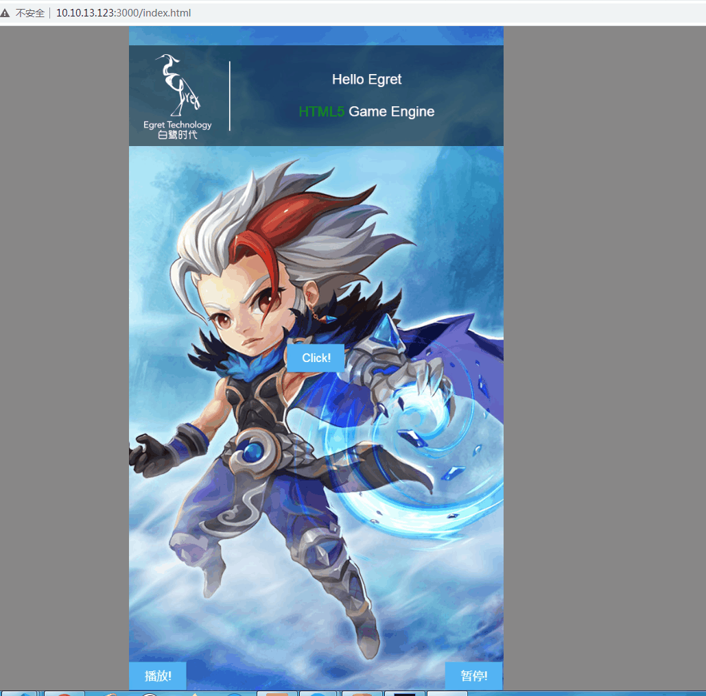

## egretVideo
视频与引擎的结合不全屏，引擎版本 `3.2.6` 

## 支持 PC 和移动端
目前测试苹果微信、安卓微信正常播放，不会被劫持

## 注意
- 低版本安卓无法正常使用，这边测试的是安卓 `5.0` 版本
- 各小游戏平台未测试
- 只支持 `canvas` 模式
- 引擎最新的 `5.X` 版本未测试

## 主要方式
基于官方视频播放组件，重新封装了一下 `WebVideo` 这个类，主要是去掉了引擎自带的默认在移动端全屏问题 

## 目前功能
- 不全屏，可以改变视频的宽高
- 可以自定义层级关系，视频内容嵌入在背景和UI中间

## PC展示截图

